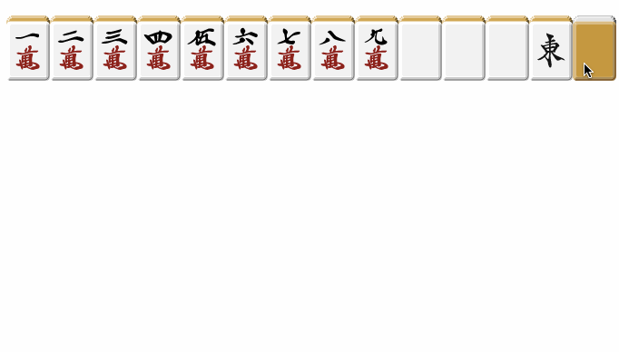

# Mahjong Tile Picker

麻雀牌ピッカー

A small JavaScript library for choosing mahjong tiles on a website.
Take a look at the `typescript` branch for the code in TypeScript.



[DEMO](http://takumif.github.io/mahjong-tile-picker/)

## Usage
HTML:
```html
<head>
    <script src="path/to/mahjong_tile_picker.js"></script>
    <link rel="stylesheet" type="text/css" href="path/to/mahjong_tile_picker.css">
</head>
<body>
    <div id="parentHtmlElementId"></div>
</body>
```

JavaScript:
```javascript
// Call this after the page has loaded. The second argument is optional.
var picker = new MahjongTilePicker("parentHtmlElementId", "Text to put on buttons");

console.log(picker.getTile()); // initially null

// Let the user pick a tile, or
// programmatically pick one:
picker.pickTile(Tile.W9);

picker.getTile(); // Tile.W9
Tile[picker.getTile()]; // 'W9'
```

The `Tile` enum contains values `W1-W9, W5_red, T1-T9, T5_red, S1-S9, S5_red, East, South, West, North, White, Green, Red`.
W for wanzi (characters), T for tongzi (circles), and S for suozi (bamboos). `W5_red`, etc. are doras.
```javascript
Tile.W1 // 0
Tile[Tile.W1] // 'W1'
```

You can also set a callback function:
```javascript
picker.onTilePicked = function(tile) {
    console.log("You just picked " + Tile[tile] + "!");
}

// now pick a tile, either manually or programmatically
picker.pickTile(Tile.East);
// log: You just picked East!
```

## License
* MIT
* The image assets are by Aki ([source](http://sozai.7gates.net/docs/mahjong01/))